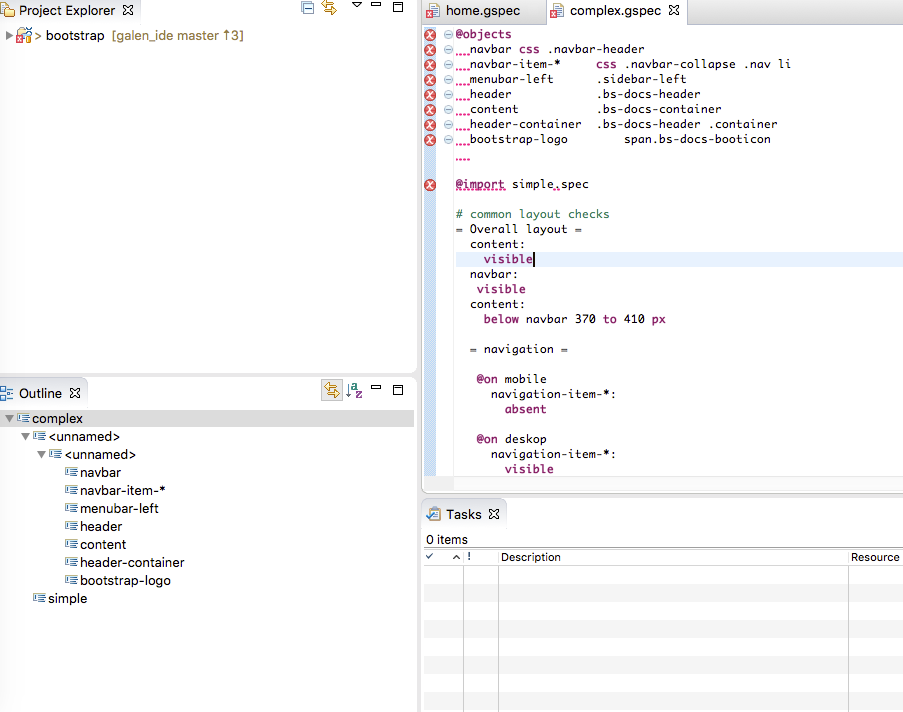
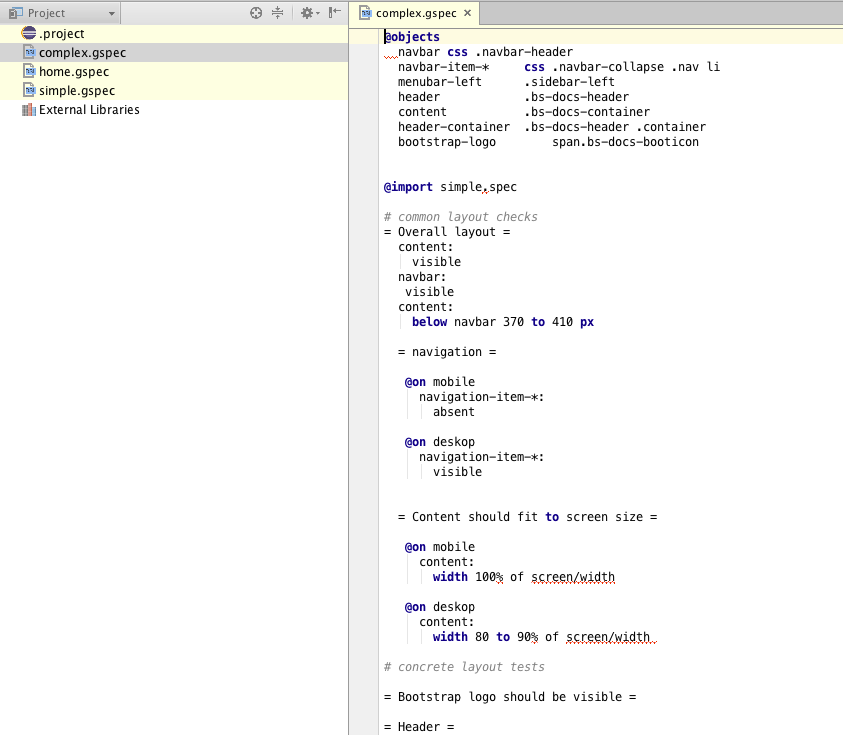

# Galen IDE integration

Vote on [`Kickstarter`](https://www.kickstarter.com/projects/1453417775/1487427501) for the project.

[](https://travis-ci.org/hypery2k/galen_ide)
[](https://jenkins.martinreinhardt-online.de/blue/organizations/jenkins/Galen%2Fgalen_ide_build/activity)
[](https://flattr.com/submit/auto?user_id=mreinhardt&url=https://github.com/hypery2k/galen_ide&title=badges&language=&tags=github&category=software)

> Integration for Web, Eclipse and IDEA development environement for the [GalenFramework](http://galenframework.com)

<a name="donation"></a>
> Feel free to **donate**
>
> <a target="_blank" href="https://www.paypal.com/cgi-bin/webscr?cmd=_s-xclick&hosted_button_id=AGPGLZYNV6Y5S">
> 
> </img></a>
> Or donate Bitcoins: bitcoin:3NKtxw1SRYgess5ev4Ri54GekoAgkR213D
>
> [](bitcoin:3NKtxw1SRYgess5ev4Ri54GekoAgkR213D)
>
> Also via [greenaddress](https://greenaddress.it/pay/GA3ZPfh7As3Gc2oP6pQ1njxMij88u/)

## Try it out


### Eclipse
#### Update Site

Plugin is available as [continous build](https://updates.martinreinhardt-online.de/galen_ide/nightly/repository/). The latest working build is published there.

#### build

Download [Xtext Eclipse Beta](https://www.eclipse.org/Xtext/news.html#download-links) and copy the [latest plugins](https://github.com/hypery2k/galen_ide/releases/latest) into the dropins folder:


### IDEA

#### Update Site

Plugin is available via [canary channel](https://plugins.jetbrains.com/plugin/8302). The latest working build is published there. The plugin is compatible with:
* IntelliJ IDEA
* IntelliJ IDEA Community Edition
* Rider
* Android Studio

To install the Canary Release add the following repository manually:
`https://plugins.jetbrains.com/plugins/canary/list`

#### build
```bash
cd com.galenframework.specs.parent/com.galenframework.specs.idea
./gradlew runIdea
````


### Web

Preview is available [here](https://martinreinhardt-online.de/galen_ide/).
