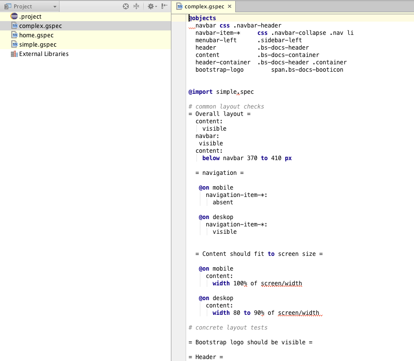

# Galen IDE integration

Vote on [`Kickstarter`](https://www.kickstarter.com/projects/1453417775/plugins-for-intellij-and-eclipse-for-galen-layout) for the project.

> Integration for Web, Eclipse and IDEA development environement for the [GalenFramework](http://galenframework.com)

[](https://travis-ci.org/hypery2k/galen_ide)


## Try it out


### Eclipse
Download [Xtext Eclipse Beta](https://www.eclipse.org/Xtext/news.html#download-links) and copy the [latest plugins](https://github.com/hypery2k/galen_ide/releases/latest) into the dropins folder:


### IDEA
```bash
cd com.galenframework.parent
cd com.galenframework.idea
./gradlew runIdea
````


## Dev instructions

For local setup use [Xtext 2.9.0beta5](https://www.eclipse.org/modeling/tmf/downloads/?showAll=1&hlbuild=S201510020259&project=xtext#S201510020259) or above and clone this repository.

Then in the repository run:

```bash
cd com.galenframework.parent
mvn install eclipse:eclipse
```
